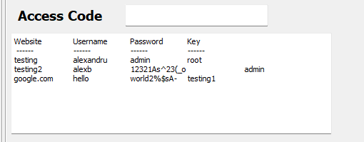

# SIMPLE PASSWORD MANAGER

The Main Window UI screen without any input values added.

If I want to see the content from database I need to provide the Access Code, and if I put it wrongly than I will see a Warning message in that Text Area.

For testing purpose I added "root" as value for Access Code and now I can see the content from database that is in relation with that Key.

The added password need to be atleast 8 length and need one digit, one lower case, one upper case and one special character, if this are all true than I will receive a success message

We added password with Access Code "testing1" and now we can see it in the text area.

